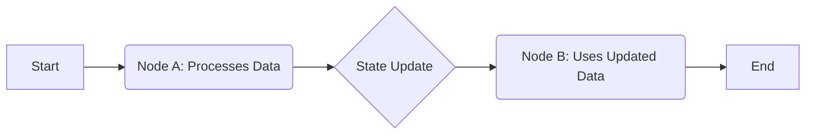

# LangGraph: State-Driven Workflows

## Overview

- Basically, we need data points and values related to workflows
- As the workflow evolves, data points get updated
- This helps to identify the current state in the application
- All these data points form **states**
- State management is very important in LangGraph

## What is State?

In LangGraph, the **State** is the "single source of truth." It is a persistent object that tracks data points as they move through a graph, allowing the application to maintain context, make decisions, and track the current progress of a workflow.

## 📋 Core Concepts

### 1. The State Schema

Every workflow begins with a defined **Schema**. This is a structured collection of all the data points your application needs to track.

- **Input Data**: The initial query or configuration
- **Internal Variables**: Temporary calculations, LLM thought processes, or search results
- **Output Data**: The final response or status code

### 2. State Evolution (The Update Cycle)

As the workflow "evolves," it moves through a series of **Nodes**. Each node is a function that:

1. Receives the current state
2. Processes logic (LLM calls, API requests, etc.)
3. Returns an update to specific data points

## Workflow Diagram

